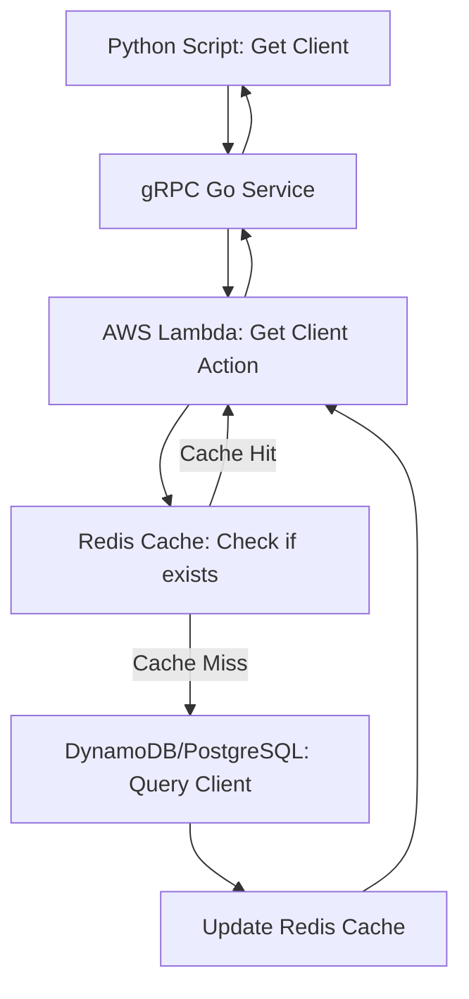
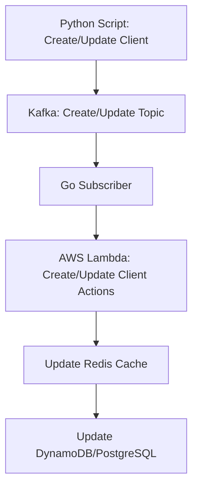
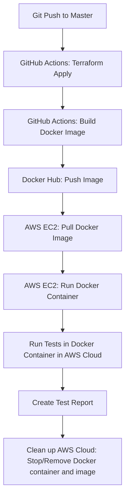

# Microservices Pipeline AWS Demo

## Project Overview
This project demonstrates a microservices architecture pipeline for managing client data using technologies like Python, Go, Kafka, gRPC, AWS Lambda, Redis, PostgreSQL, and DynamoDB. The core functionality involves handling and storing client information in AWS DynamoDB and PostgreSQL, leveraging a variety of modern tools with Terraform for AWS EC2 deployment (t2.micro). CI/CD is managed through GitHub Actions.

## Purpose
This demo project intentionally showcases a complex architecture to serve as a **framework** or an **example** for building scalable, high-load, and maintainable microservices applications. While a simple client data storage task (used in this project) could be done with a single Python service and a local DynamoDB/PostgreSQL setup, this project illustrates how microservices interact with distributed components, offering a reusable skeleton for more advanced features such as authentication, analytics, and additional services.

## Project Architecture

### Get Requests:


### Create/Update Requests:


### CI/CD Flow:


### Example Client Data:
```json
{
    "id": "1",
    "first_name": "John",
    "second_name": "Doe",
    "phone": "555-1234"
}
```

## Prerequisites
- Docker
- AWS account and credentials (~/.aws/credentials)
- Terraform installed
- Go 1.21.1+
- Python 3.10+
- Redis
- Kafka

## Additional Features for Production

In a production environment, additional components and features may be required to ensure the robustness, security, and scalability of the application. Some of these additions include:

- **Monitoring and Logging**: Tools like Prometheus, Grafana, the ELK Stack (Elasticsearch, Logstash, Kibana), or AWS CloudWatch can be integrated to monitor application performance, track logs, and set up alerts for any issues that arise.
  
- **Authentication and Authorization**: Services like AWS Cognito, OAuth, or JWT (JSON Web Token) can be added to provide secure access to the application, ensuring that only authorized users can interact with the system.

- **Data Backup and Recovery**: Implementing AWS Backup or S3 for regular backups will help ensure that client data is secure and can be restored in case of data loss or corruption.

- **Scalability and Orchestration**: In production, the ability to scale the application based on demand is crucial. Tools like Kubernetes or AWS ECS (Elastic Container Service) can be used to automatically manage container scaling and orchestration.

- **Testing (Unit and Load Testing)**: For production-readiness, unit tests (JUnit, pytest) and load testing (Locust) can be added to ensure that the application performs well under expected traffic and stress scenarios.

- **Configuration Management**: AWS Parameter Store or HashiCorp Vault can be used to manage application configurations and sensitive data (e.g., API keys, credentials) securely, preventing hard-coding of secrets.

- **Secrets Management**: AWS Secrets Manager can be used to store and manage sensitive information such as database credentials, API keys, or third-party service tokens in a secure and scalable way.

These additions will enhance the application's production-readiness by ensuring better security, scalability, and performance management.